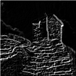

# HLS Sobel Filter based on Xilinx Vitis Video Library (L1) using AXI-Stream interfaces
* 24 Bit AXI-Stream width (Can be modified easy)
* Uses Vitis Layer 1 (L1) for integration into Vivado Block Design

# Requirements 
* Xilinx Vitis/Vivado 2020.2 installation
* Xilinx Vitis Libraries (Tag 2020.2_rel) (https://github.com/Xilinx/Vitis_Libraries.git)
* OpenCV installation (Tag 3.3.0) (https://github.com/opencv/opencv.git)

# How to Compile
* Setup environment paths in Makefile 
* Setup part number and clkp in run_hls.tcl
* Check simulation output image "output_csim.png"
* IP core is generated under export/

# Known Issues
* Due to a Vitis 2020.2 bug cosim is not working (use csim instead)
